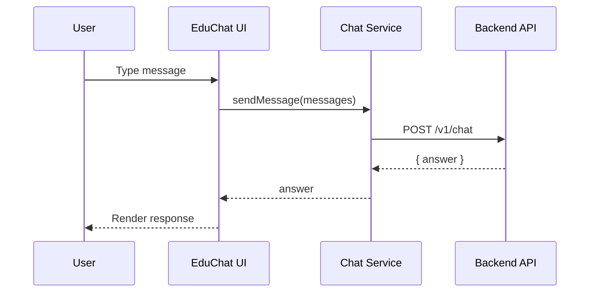

# EduChat

Vietnamese admissions chatbot UI built with Vite + React, designed to run in mock mode, talk to a backend API, or (optionally) call a public LLM directly from the browser.

## Introduction

EduChat is a front-end application that delivers a modern, conversational admissions experience for prospective students. It supports three execution modes:

- Mock mode for rapid UI and UX iteration.
- API mode to connect to a backend service.
- Public LLM mode (browser-based) for quick demos without a server.

The project is structured for fast development, clean separation of UI and services, and simple environment-based configuration.

## Key Features

- Modular chat UI components (header, message list, input, suggestions).
- Configurable chat runtime (mock, backend API, or public LLM).
- Session-aware API integration (chat).
- Tailwind-powered styling and component utilities.
- Vite-based dev server with fast HMR.

## Overall Architecture

### High-level flow

```mermaid
flowchart TD
  U[User] --> UI[EduChat UI (Vite + React)]
  UI --> CS[Chat Service]
  CS -->|mock| MK[Mock Responses]
  CS -->|api| API[Backend API]
  CS -->|public LLM| LLM[OpenAI SDK in Browser]
```

### Request lifecycle (API mode)



### Backend API contract (expected)

- `POST /v1/chat` → send messages, returns `answer`.

## Installation

### Prerequisites

- Node.js 18+ recommended
- pnpm 10+ (project uses pnpm)

### Setup

```bash
cd ui
pnpm install
```

## Running the Project

```bash
cd ui
pnpm dev
```

Build and preview:

```bash
cd ui
pnpm build
pnpm start
```

## Environment Configuration

Copy the example file and edit values as needed.

```bash
cd ui
cp .env.example .env
```

### Variables

| Variable                | Description                        | Example                 |
| ----------------------- | ---------------------------------- | ----------------------- |
| `VITE_API_MODE`         | Runtime mode: `mock` or `api`      | `mock`                  |
| `VITE_API_BASE_URL`     | Base URL for backend API           | `http://localhost:8000` |
| `VITE_SERVER_HOST`      | Hostname for server                | `localhost`             |
| `VITE_GPT_MODEL`        | Model name used by OpenAI SDK      | `gpt-5.2-chat-latest`   |
| `VITE_USING_PUBLIC_LLM` | Enables browser-based OpenAI calls | `true`                  |
| `VITE_OPENAI_API_KEY`   | OpenAI API key (browser use)       | `sk-...`                |

### Example `.env`

```bash
VITE_API_MODE=mock
VITE_API_BASE_URL=http://localhost:8000
VITE_SERVER_HOST=localhost

VITE_GPT_MODEL=gpt-5.2-chat-latest
VITE_USING_PUBLIC_LLM=true
VITE_OPENAI_API_KEY=sk-your-key-here
```

### Security note

Using a public LLM from the browser exposes your API key to end users. For production, prefer API mode with a secure backend that proxies model requests.

## Folder Structure

```text
educhat/
  README.md
  ui/
    .env.example
    package.json
    index.html
    public/
    src/
      app/
        components/
        services/
        types/
      styles/
      main.tsx
    vite.config.ts
```

## Usage Examples

### Mock mode (fast UI testing)

```bash
VITE_API_MODE=mock
```

### API mode (backend integration)

```bash
VITE_API_MODE=api
VITE_API_BASE_URL=http://localhost:8000
```

### Public LLM mode (demo only)

```bash
VITE_API_MODE=api
VITE_USING_PUBLIC_LLM=true
VITE_OPENAI_API_KEY=sk-your-key-here
```

## Contribution Guidelines

1. Fork or branch from `main`.
2. Install dependencies with `pnpm install`.
3. Make changes in `ui/` and keep scope focused.
4. Test with `pnpm dev` and verify UI flows.
5. Open a merge request with a clear summary and screenshots for UI changes.

## License

No license file is present in the repository. Add a `LICENSE` file to define usage terms. Until then, default copyright applies.

## Roadmap

- Backend integration guide and API schema documentation.
- Message streaming and typing indicators.
- Internationalization support (multi-language prompts).
- Authentication and rate limiting support.
- Design system extraction for shared UI components.
